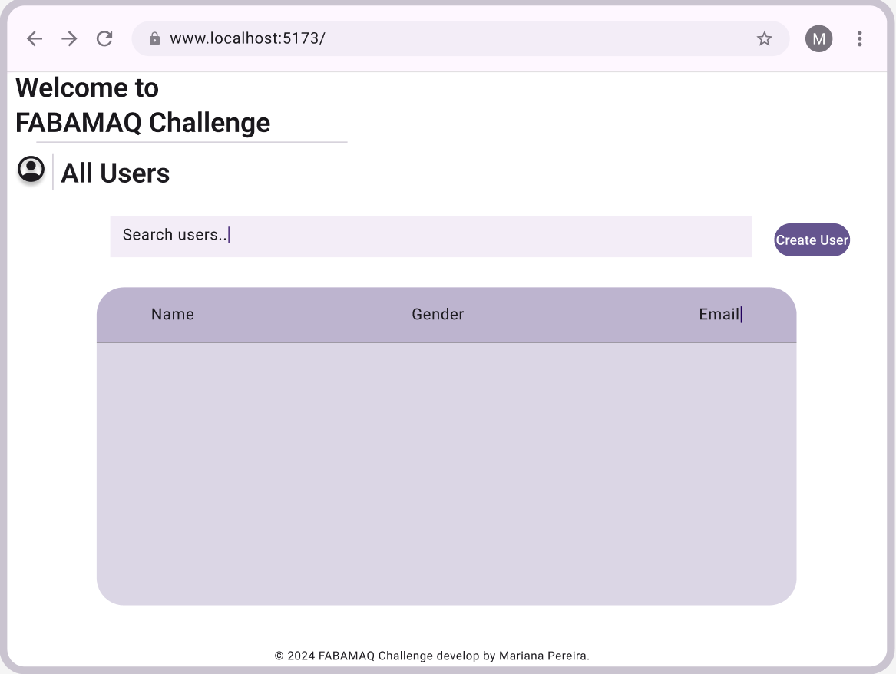
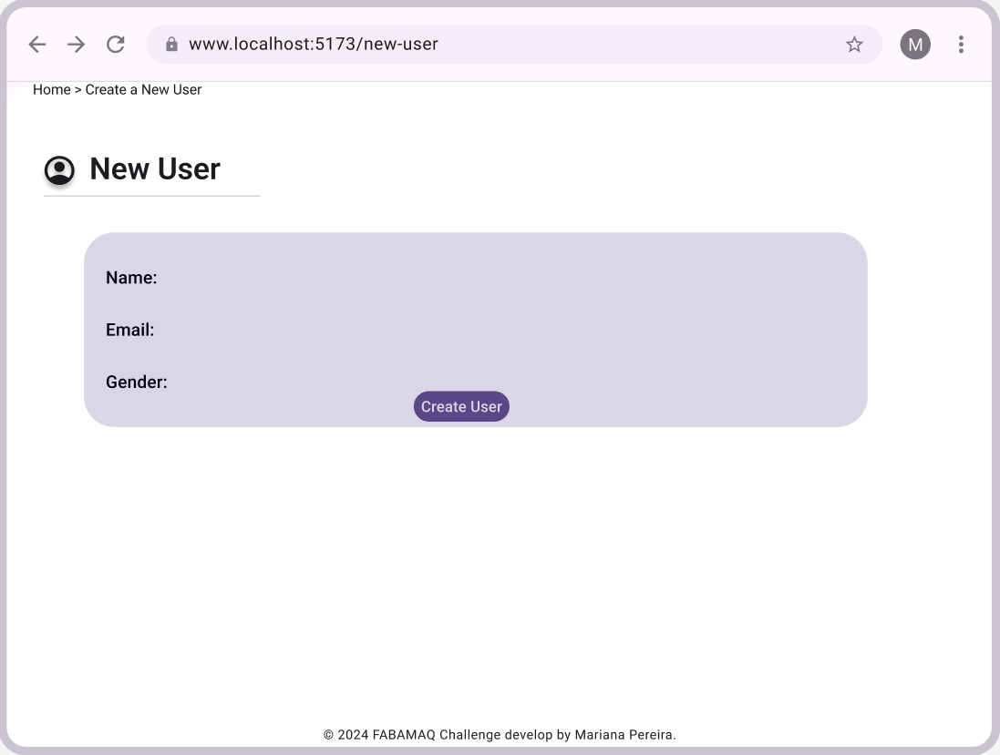
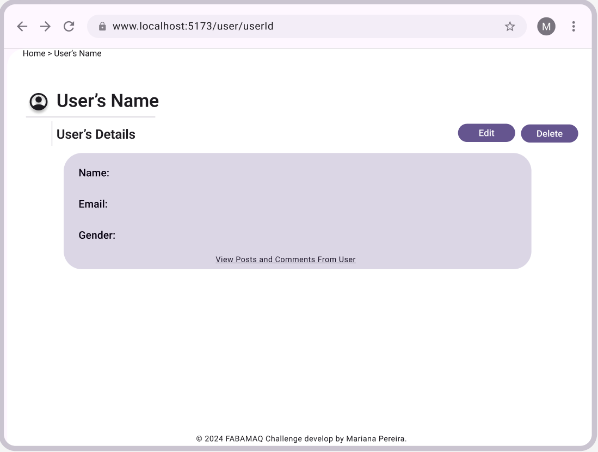
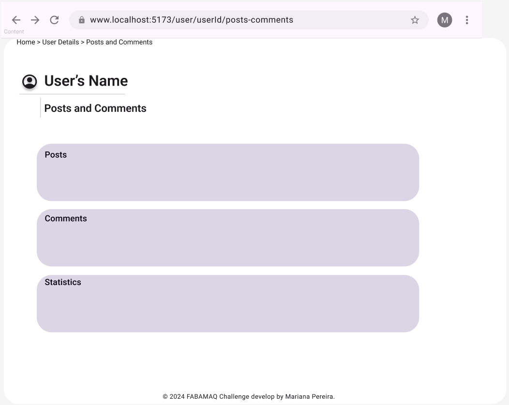

# FABAMAQ Challenge

## Introduction
This project is a user interface for managing users, their posts, and comments using the GO REST API. The application allows you to list, search, and perform CRUD operations on users. Additionally, it provides detailed user pages with their posts, comments, and statistics.  

## About Me
My name is Mariana Pereira, and I developed this application as part of a challenge from FABAMAQ. I have utilized my skills in React and CSS to create a user-friendly and visually appealing interface.  

## How to Run the Application
To run this application locally, follow these steps:  
1. **Clone the Repository** Open your terminal and run the following command to clone the repository: <pre>git clone https://github.com/marianafpereira/FABAMAQ_Challenge.git </pre>
2. **Install Dependecies** Open your terminal and run the following command to install dependencies: <pre>npm install </pre>
3. **Navigate to the Project Directory**  Change your current directory to the project directory:  <pre>cd fabamaq_users </pre>
4. **Run the Application** by starting the development server:  <pre>npm run dev </pre> The application should now be running on http://localhost:5173.  

## Features
1. **User Listing**: View a list of users with the ability to search and filter.
2. **CRUD Operations**: Create, read, update, and delete users.
3. **User Details Page**: View detailed information about a user.
4. **User Posts And Comments Page**: View posts and comments from user including their statistics related to the user, such as the number of posts and comments.

## Technologies Used
- **React**: For building the user interface.
- **CSS**: For styling the application.
- **GO REST API**: For fetching user data, posts, and comments.
- **Vite**: For building and serving the application.
- **Toastify**: For displaying success and error messages.
- **Phosphor Icons**: For using icons in the application.
- **GraphQL**: For fetching data using GraphQL queries.
- **React Router**: For routing within the application.
- **React Query**: For fetching and caching data.
- **https://s.muz.li/ODM2MGYyMzQz**: For design of the waves.svg background.

Thank you for reviewing my application. If you have any questions, please feel free to contact me.

## Project Structure and Explanation

### Components
- **BaseLayout**: Contains `BaseLayout.jsx` and the `Content.jsx`. This `BaseLayout.jsx` component is used to provide a consistent layout for pages, including a header and main content area. The `Content.jsx` component is used to display a section with a heading and optional buttons.
- **Breadcrumb**: Contains `Breadcrumb.jsx` and `Breadcrumb.css`. This component is used to display the navigation path (breadcrumbs) for the user.
- **Footer**: Contains `Footer.jsx`. This component is used to display the footer of the application.
- **Headings**: Contains `TitleHeading.jsx`, `TitleHeading.css`, and `SectionHeading.jsx`. These components are used to display various headings and titles throughout the application.
- **Loading**: Contains `Loading.jsx` and the `loading.module.css`. This component is used to display a loading spinner or message when data is being fetched.
- **SearchBar**: Contains `SearchBar.jsx` and `SearchBar.css`. This component is used to display a search bar for searching users.
- **UserList**: Contains `UserList.jsx`. This component is used to display a list of users with search and filter functionality.
- **UserStatistics**: Contains `UserStatistics.jsx`. This component is used to display statistics related to users, such as the number of posts and comments.

### Data
- **urls.js**: Contains constants for the API base URL and API key.

### Pages
- **HomePage.jsx**: This page is the landing page of the application. It provides an overview and navigation to other parts of the application.
- **NewUserPage.jsx**: This page is used to create a new user. It contains a form for entering user details and handles form submission.
- **UserPage.jsx**: This page displays the details of a specific user. It allows editing and deleting the user and displays user details such as name, gender, and email.
- **UserPostsCommentsPage.jsx**: This page displays the posts and comments of a specific user. It fetches and displays the user's posts and comments and provides statistics on the number of posts and comments.
- **ErrorPage.jsx**: This page is displayed when an error occurs. It shows an error message to the user.
- **LoadingPage.jsx**: This page is displayed when the application is loading data. It shows a loading spinner or message.

### Router
- **index.jsx**: This file sets up the React application and renders the App component.

### Services
- **UserService.jsx**: Contains functions for fetching, updating, and deleting users from the API.
- **PostsService.jsx**: Contains functions for fetching posts and comments related to users.
- **NewUserService.jsx**: Contains a function for handling the submission of a new user.
- **GraphQLService.jsx**: Contains functions for fetching data using GraphQL queries.
- **CommentsService.jsx**: Contains functions for fetching comments related to posts.

### Styles
- **index.css**: The main CSS file that imports other CSS files and contains global styles.
- **form.css**: Contains styles for forms, including input fields, labels, and buttons.
- **button.css**: Contains styles for buttons, including primary and secondary button styles.
- **animation.css**: Contains keyframe animations and styles for animating elements.
- **UserPage.css**: Contains styles specific to the UserPage component.
- **NewUserPage.css**: Contains styles specific to the NewUserPage component.
- **UserPostsCommentsPage.css**: Contains styles specific to the UserPostsCommentsPage component.
- **HomePage.css**: Contains styles specific to the HomePage component.
- **layout.css**: Contains styles for the overall layout of the application.
- **nav.css**: Contains styles for the navigation elements.
- **reset.css**: Contains CSS reset styles to ensure consistency across browsers.
- **status.module.css**: Contains styles specific to the status and error pages.
- **text-decoration.css**: Contains styles for text decorations like underlines and side lines.
- **UserList.css**: Contains styles specific to the UserList component.

### App
- **App.jsx**: The main component that contains the routing logic for the application.
- **App.css**: Contains global styles for the application.

### Main.jsx
- **Main.jsx**: The main entry point for the application. It renders the App component.

## Pages Detailed Explanation

### NewUserPage.jsx
- **Purpose**: To create a new user.
- **Components Used**: TitleHeading, Footer, Breadcrumbs, ToastContainer and icons from `@phosphor-icons/react`.
- **Functionality**:
    - Displays a form for entering user details (name, email, gender) The status is pre-defined as active.
    - Handles form submission and calls the handleSubmit function from `NewUserService.jsx`.
    - Displays success or error messages using `react-toastify`.
    - Provides navigation to the HomePage.

### UserPage.jsx
- **Purpose**: To display and manage user details.
- **Components Used**: TitleHeading, Footer, ToastContainer, Breadcrumbs, Loading, SectionHeading, ErrorPage and icons from `@phosphor-icons/react`.
- **Functionality**:
    - Fetches and displays user details (name, gender, email).
    - Allows editing and deleting the user.
    - Displays success or error messages using `react-toastify`.
    - Provides navigation to the user's posts and comments page and also to the HomePage.

### UserPostsCommentsPage.jsx
- **Purpose**: To display the posts and comments of a specific user.
- **Components Used**: TitleHeading, Footer, Loading, Breadcrumbs, SectionHeading, ErrorPage and icons from `@phosphor-icons/react`.
- **Functionality**:
    - Fetches and displays the user's posts and comments.
    - Provides statistics on the number of posts and comments.
    - Displays loading spinner while fetching data.
    - Handles and displays errors if data fetching fails.
    - Provides navigation to the user's details page and also to the HomePage.

### ErrorPage.jsx
- **Purpose**: To display an error message when an error occurs.
- **Components Used**: Warning icon from `@phosphor-icons/react`.
- **Functionality**:
    - Displays a generic error message or a custom error message passed as a prop.
    - Uses `useRouteError` to get the error from the router context.

### HomePage.jsx
- **Purpose**: To serve as the landing page of the application.
- **Components Used**: SectionHeading, Footer, BaseLayout, SearchBar, UserList, Loading, ErrorPage and icons from `@phosphor-icons/react`.
- **Functionality**:
    - Provides an overview of the application.
    - Allows navigation to other parts of the application.
    - Displays a search bar for searching users.

### LoadingPage.jsx
- **Purpose**: To display a loading spinner or message when data is being fetched.
- **Components Used**: Loading.
- **Functionality**:
    - Shows a loading spinner or message while data is being fetched.

## Design Decisions
To ensure a user-friendly and visually appealing interface, I used Figma to sketch the layout and design of the application. This helped in visualizing the structure and flow of the application before starting the development process.  

### Pages Designed
- **Home Page**: The landing page that provides an overview and navigation to other parts of the application.
- **New User Page**: A form page for creating a new user.
- **User Details Page**: Displays detailed information about a user, including options to edit or delete the user.
- **User Posts and Comments Page**: Shows the posts and comments of a specific user along with relevant statistics.

### Figma Sketches
Below are the images of the Figma sketches for the different pages:  
- **Home Page**:
</img> 
- **New User Page**:
</img> 
- **User Details Page**:
</img>
- **User Posts and Comments Page**:
</img>

## Conclution
This project demonstrates a comprehensive approach to user management using React and the GO REST API. 
By leveraging modern web development tools and best practices, the application provides a robust and user-friendly interface for managing users, their posts, and comments. 
The use of Figma for design sketches ensured a well-planned and visually appealing layout, enhancing the overall user experience. 
Thank you for reviewing my application. If you have any questions, please feel free to contact me.

